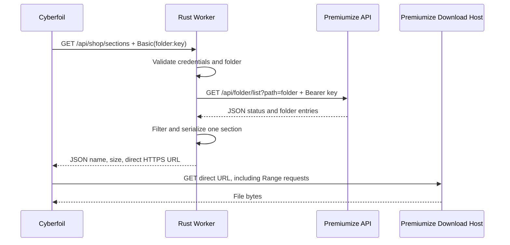

# Premiumize Cyberfoil Proxy: Technical Documentation

This document describes the implemented shop adapter, not a general-purpose HTTP or file proxy. Operator setup and GitHub deployment instructions are in the [README](../README.md).

## Scope and Architecture

The application compiles Rust to `wasm32-unknown-unknown` and uses `worker` 0.8.5 to run inside Cloudflare Workers. It has no native server process, application database, disk storage, cache binding or background task. Node.js is used for build tooling and integration tests, not the production application.



Only the first catalog exchange involves the Worker. No Worker endpoint resolves, refreshes, redirects or streams downloads. Icons, save synchronization, uploads, recursive traversal, external metadata and user administration are outside the implementation.

## Source Ownership

| File | Responsibility |
| --- | --- |
| [src/lib.rs](../src/lib.rs) | `fetch`, route/method decisions, `serve_catalog`, `ShopError`, common JSON response headers |
| [src/auth.rs](../src/auth.rs) | `Credentials::parse`, folder normalization and `folder_url` construction |
| [src/premiumize.rs](../src/premiumize.rs) | `list_folder`, one outbound fetch, response bound, timeout, HTTP/API error translation |
| [src/catalog.rs](../src/catalog.rs) | Minimal typed API models, `FolderResponse::into_catalog`, extension filtering and link validation |
| [tests/shop.test.mjs](../tests/shop.test.mjs) | Compiled-Wasm tests with intercepted outbound requests; optional inspector profile |
| [Cargo.toml](../Cargo.toml) | Library output (`cdylib` and `rlib`), runtime dependencies, release settings |
| [wrangler.toml](../wrangler.toml) | Worker name, bundle entry point, compatibility date and custom build |
| [.github/workflows/deploy.yml](../.github/workflows/deploy.yml) | Test-gated deployment to the GitHub `production` environment |

## Incoming HTTP Contract

Only exact paths `/api/shop/sections` and `/` are recognized. Both use the same handler and return the modern sections format, which is also accepted at the root by Cyberfoil's legacy mode. Queries do not select a folder or upstream host. A trailing slash on `/api/shop/sections/` does not match the route.

The path check occurs before method and authentication checks. Unknown paths return `404` without an upstream request. Recognized paths accept `GET` only; other methods return `405` and `Allow: GET`, also without contacting Premiumize. There is no CORS preflight API or separate `HEAD` implementation.

All application-generated JSON responses set:

```http
Content-Type: application/json; charset=utf-8
Cache-Control: private, no-store
X-Content-Type-Options: nosniff
Referrer-Policy: no-referrer
```

An authentication failure additionally sets:

```http
WWW-Authenticate: Basic realm="Premiumize shop", charset="UTF-8"
```

Successful catalog shape:

```json
{
  "sections": [
    {
      "id": "premiumize",
      "title": "switch",
      "items": [
        {
          "name": "Example.nsp",
          "size": 5000000000,
          "url": "https://download.example.test/Example.nsp?token=EXAMPLE"
        }
      ]
    }
  ]
}
```

The example URL is illustrative, not a usable Premiumize download. There is always one section, including for an empty folder. Its title is the normalized folder path, or `Premiumize` for root. No `success` MOTD, title ID, version, app type, release date or icon URL is emitted.

## Credential and Folder Validation

1. Require an `Authorization` header of at most 8,192 bytes.
2. Split the scheme at the first ASCII space; match `Basic` case-insensitively. Trim outer whitespace around its encoded value, then decode standard Base64 and UTF-8.
3. Split decoded credentials at the first colon. Username and password must be nonempty. Additional password colons are retained. The API key must be ASCII without whitespace or control characters.
4. Remove at most one leading slash and one trailing slash from the username. `/` is the only accepted spelling that normalizes to root.
5. Reject empty interior path segments, `.` and `..` segments, backslashes and control characters. Preserve case, Unicode, spaces and literal percent sequences in otherwise valid folder names.
6. Construct the query with `url::Url::query_pairs_mut`. The username is not percent-decoded first, preventing query syntax from being interpreted as request parameters.

Malformed headers and key syntax return `401`. Invalid folder syntax returns `400`. There is no local key database, account verification preflight or fallback to environment variables. Successful authentication ultimately depends on Premiumize accepting the key.

Credentials have no `Debug` implementation. They are held for the request and are not intentionally persisted, logged or cached; they are not explicitly zeroized from memory.

## Premiumize Request and Parsing

`list_folder` constructs one new GET request to the fixed origin and endpoint:

```text
https://www.premiumize.me/api/folder/list
```

For non-root folders, it adds the encoded `path` query parameter. Root omits that parameter. Outbound headers are `Authorization: Bearer <key>` and `Accept: application/json`; the incoming client headers are not copied. `CacheMode::NoStore` disables upstream caching. `RequestRedirect::Manual` prevents following redirects with credentials; any redirect status is translated to a sanitized `502`.

The endpoint contract comes from the supplied [Premiumize API specification](premiumize-me/api.md). The adapter does not call `account/info`, `item/details`, `item/listall`, folder search or HTTPS directory listings, and does not inspect returned download bodies. It does not retry failed calls internally.

HTTP status must be exactly `200` before parsing a listing. The body is read incrementally into a bounded byte buffer and deserialized once with `serde_json::from_slice`. The minimal response model contains:

| Field | Type and behavior |
| --- | --- |
| `status` | Required typed `success` or `error`; unknown/missing values fail parsing |
| `content` | Optional array, required for a successful catalog |
| `code` | Optional string; missing error codes map to the generic upstream error |
| Other fields | Ignored; upstream human-readable messages are never returned |

Entries require string `type` and `name`; `size` is optional `u64` and `link` is optional string. Structurally invalid entries fail deserialization before filtering. Missing fields on an eligible item fail conversion. The model reads fields directly rather than using an internally tagged enum that buffers the contents during deserialization.

## Item Conversion

An entry is eligible when its type is exactly `file`, its filename stem is nonempty, and its extension is `.nsp`, `.nsz`, `.xci` or `.xcz` (case-insensitive). Folders, unknown types and unrelated extensions are excluded. No folder or file-detail lookups follow.

For each eligible item:

- Preserve `name` and the original order.
- Require `size` as `u64`. Negative or non-integral values are rejected by parsing; sizes over 4 GiB are supported, and zero is accepted.
- Require an absolute URL parsed as HTTPS with a host, no username/password, and no literal control or whitespace characters.
- Return the original validated link string, not a reserialized or rewritten URL. Signed query values therefore remain unchanged.

The adapter trusts links from the fixed Premiumize API but has no CDN hostname allowlist. It does not guarantee their expiry, IP portability or availability. An invalid eligible item fails the entire catalog with `502`; it does not produce a partial success or guess a download URL. URLs cannot be supplied directly by the caller.

## Resource and Failure Boundaries

| Bound | Implementation |
| --- | --- |
| Credential header | At most 8 KiB, checked before Base64 decoding |
| Catalog body | At most 4 MiB accumulated bytes; oversized parsed Content-Length is rejected early, and every incoming chunk is checked independently of the header |
| Upstream time | A 20-second `worker::Delay` races the fetch/body-read operation; the fetch is canceled with `AbortController` on completion or failure |
| API requests | At most one network fetch per accepted catalog invocation; no retries, redirect following or recursion |
| State | No persistent state or explicit shared per-user cache |

The asynchronous deadline covers waiting for headers and body chunks. It cannot interrupt synchronous JSON parsing/conversion while a Wasm poll is executing; Cloudflare's CPU limit is the final execution bound. The input-size cap does not bound all transient SDK chunk copies or the parsed/output allocations, and the 128 MB isolate limit is shared across concurrent requests. There is no explicit file-count cap.

Application errors use `{"error":"English message"}`. Raw provider messages and SDK exceptions are discarded. Error translation is ordered: HTTP errors are handled first; only an HTTP-200 JSON body reaches API-code handling.

| Source | Outgoing status |
| --- | --- |
| HTTP `401`, API `authentication_failed` | `401` |
| HTTP `403`, API `permission_denied` | `403` |
| HTTP `404`, API `not_found` | `404` |
| API `invalid_request` | `400` |
| HTTP `429`, API `rate_limit_reached`, `account_limit_reached`, `service_limit_reached` | `429` |
| HTTP `503`, API `service_down`, `semi_permanent_error` | `503` |
| HTTP `408`/`504`, local asynchronous deadline | `504` |
| Other HTTP status, network failure, unknown API code, malformed data or invalid eligible item | `502` |
| Oversized listing | `502`, with a message suggesting a smaller folder |

`Retry-After` is forwarded only with `429` or `503` and only if it is a nonempty unsigned decimal within `u64` or a date accepted by `httpdate`. No account reset time is inferred. The client performs any retries. Cloudflare quota/runtime failures can bypass this handler and return platform-specific responses.

## Security Boundaries and Configuration

The folder is a selector, not an ACL. Anyone with the key can request another folder or access the Premiumize account directly. There is no server-side single-account restriction or rate limiter.

| Value | Location and use |
| --- | --- |
| `PREMIUMIZE_API_KEY` | Ignored local `.env` input for the README's explicit smoke-test client; not a deployment secret or default Worker account |
| `PREMIUMIZE_DIRECTORY` | Ignored local `.env` input for the same test; passed as the client's Basic username |
| `CLOUDFLARE_API_TOKEN` | GitHub `production` environment secret, exposed only to the deployment step |
| `CLOUDFLARE_ACCOUNT_ID` | GitHub `production` environment secret selecting the deployment account |
| Worker runtime bindings | None used; the fetch handler's `Env` argument is deliberately unused |

Wrangler may load `.env` during local development. `CLOUDFLARE_LOAD_DEV_VARS_FROM_DOT_ENV=false` prevents injecting it as local Worker bindings, and the workflow sets this variable as defense in depth. Git ignore rules exclude local credential files; CI checks out only committed source and does not upload a workspace artifact containing local files.

The application does not log credentials or upstream failures; persistent observability is disabled. This does not imply that Cloudflare or Premiumize never log traffic. Download URLs contain sensitive bearer-like tokens and must not be treated as public metadata.

The supplied [Cyberfoil API documentation](cyberfoil/server_api.md) says the client forwards Basic credentials to download URLs and disables certificate verification for shop requests. A catalog-only Worker cannot remove headers sent directly by the client or restore its certificate checks. HTTPS links and a fixed API origin do not eliminate these client-side risks. The [HTTPS directory scheme](premiumize-me/https-directory.md), which embeds the full account key in URL paths, is not generated by this implementation.

## Build and Deployment

`worker-build --release --locked` compiles and processes the Rust library into `build/index.js` and its Wasm module. Wrangler packages those outputs using compatibility date `2026-09-09`. Release compilation enables LTO, a single codegen unit and debug-info stripping. `Cargo.lock` and `package-lock.json` pin dependency resolution; installed `worker-build` is pinned to 0.8.5.

The [workflow](../.github/workflows/deploy.yml) uses two jobs:

1. **Validate Worker:** run on pull requests, `main` pushes and manual dispatches. Install Rust 1.98.1 and Node 22; run format, unit, lint, Wasm and compiled-runtime checks without deployment secrets.
2. **Deploy Production:** run only after successful validation on `main`, never on a pull request. Use GitHub environment `production`, serialize deployments, check out the same revision, install locked dependencies and run `npm run deploy` with scoped Cloudflare credentials. No artifact from a pull-request job is promoted to production.

The GitHub token has only `contents: read`, and checkout does not persist that token. Cloudflare's token is used only in the deploy step, but that step runs repository build commands; branch review and environment protections remain important. The GitHub environment name does not select a Wrangler environment or change the Worker name. There is no automatic rollback; use Cloudflare deployment history or a reviewed revert on `main`.

The workflow is validated locally but has not been executed in the user's GitHub account. Creating account tokens, configuring GitHub environment secrets and authorizing real deployment are operator actions documented in the README.

## Free Hosting and Verification

The design avoids file traffic, repeated per-file calls, paid bindings and persistent storage. Workers Free's relevant limits, checked September 9, 2026, are 100,000 inbound requests per day per account, 10 ms CPU per invocation, 50 subrequests and 128 MB memory per isolate. Network waiting is not CPU time. Rejected/unknown incoming requests still consume the account's request allowance. GitHub Actions minutes and Premiumize service limits are separate budgets.

The existing verification comprises 17 Rust unit tests, 17 compiled-Worker integration tests and an optional local CPU profile. Tests mock the fixed Premiumize origin and assert exact call counts, headers, credential isolation, direct-link preservation, endpoint behavior, typed errors, oversized responses and a stalled-body timeout. The 1,000-entry fixture is a regression workload, not an advertised supported maximum.

A local warmed release-Wasm profile observed roughly 7.4 ms sampled active time per 1,000-file request after reducing intermediate JSON buffering. This does not establish deployed CPU accounting, cold-start performance or operation under concurrent load. See the README for reproducible commands and deployment-size observations.

Live acceptance remains necessary for Premiumize's actual `path` handling, a nonexistent folder never silently resolving to root, direct links working from the client's IP, expiry behavior, Range responses and Cyberfoil installation. Supplied credentials are not used by automated CI tests. No code in this system turns a failed direct-download test into a file-proxy fallback.